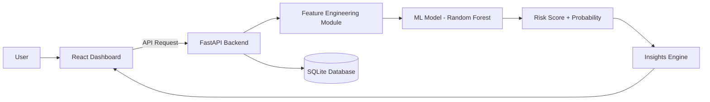

# 🏗️ Aqualyx AI – System Architecture

## Overview

Aqualyx AI follows a modular, scalable, cloud-ready architecture designed for predictive water intelligence.

The system is structured into four primary layers:

1. Presentation Layer (Frontend)
2. API Layer (Backend)
3. Machine Learning Layer
4. Data Layer

---

## 🔁 High-Level Flow

User → React Dashboard → FastAPI Backend → ML Engine → Risk Score → Insights Engine → Dashboard

---

## 📊 Architecture Diagram

---

## 🧩 Component Breakdown

### 1️⃣ Frontend (React + Tailwind)

**Core Features:**
- Interactive Dashboard UI  
- Real-time Risk Visualization  
- Usage Analytics Charts  
- CSV Upload & Data Processing  
- Savings & Environmental Impact Metrics  

**Responsibilities:**
- Display leak predictions and risk levels  
- Provide intuitive user interaction  
- Send structured usage data to backend APIs  
- Visualize insights (water saved, cost impact, carbon reduction)

---

### 2️⃣ Backend (FastAPI)

**Core Capabilities:**
- RESTful API endpoints  
- Input validation using Pydantic schemas  
- Machine learning model loading  
- Prediction processing & serving  
- Database interaction (SQLite)  

**Key Endpoints:**
- `POST /predict` → Generate leak prediction  
- `GET /health` → Service health check  
- `GET /metrics` → Model performance metrics  

---

### 3️⃣ Machine Learning Layer

**Core Functions:**
- Advanced feature engineering  
- Random Forest classification model  
- Leak probability scoring  
- Model evaluation & validation  

**Output:**
- Leak Probability (0–1)  
- Risk Category (Normal / Warning / Critical)  
- Estimated water & cost impact  

---

### 4️⃣ Data Layer

**Storage & Processing:**
- SQLite database for historical records  
- CSV ingestion and preprocessing  
- Synthetic dataset for model training  
- Feature storage for time-series analysis  

---

## ⚡ Scalability Design

Designed for enterprise-ready expansion:

- Docker containerization  
- Cloud deployment (Render / AWS / GCP)  
- IoT smart meter integration  
- Real-time data streaming capability  
- Modular architecture for scaling  

---

## 🔒 Security Considerations

- Strict input validation via Pydantic  
- CORS protection configuration  
- Sandboxed model inference environment  
- Environment-based configuration (.env variables)  
- Production-ready HTTPS deployment support  

---

## 🌍 Future Architecture Upgrades

- Apache Kafka for real-time streaming  
- TimescaleDB for optimized time-series storage  
- Cloud IoT sensor integration  
- Microservices-based architecture separation  
- Advanced monitoring & logging system  

---
